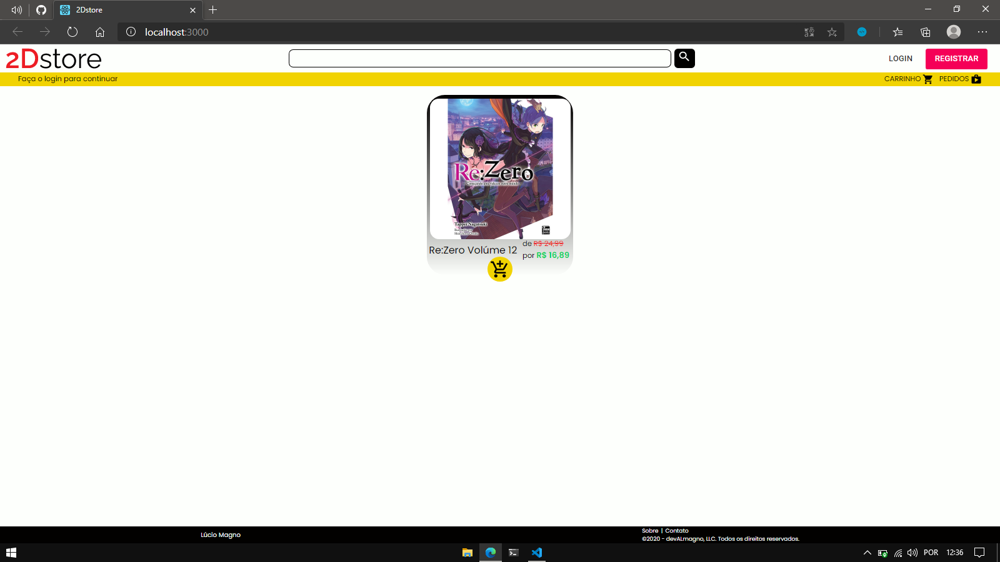

# 2Dstore | E-Commerce em ReactJS e NodeJS
### REPO. do Front-end

## Como abrir o repositório no meu computador?
#### Os links irão te levar para outra página então os abra em outra aba.
Você pode encontrar essa informação no meu [Notion.](https://www.notion.so/Configurando-o-ambiente-e-DANDO-START-0d0b6c2e84574c1fb7bc26958c032690) 
[Clique aqui para abrir.](https://www.notion.so/Configurando-o-ambiente-e-DANDO-START-0d0b6c2e84574c1fb7bc26958c032690)

Após seguir os passos presentes no Notion, basta abrir o terminal e digitar
#### npm i 
ou
#### yarn

Depois que o terminal terminar de baixar você poderá abrir a plataforma no seu computador, digitando no terminal:
### npm start
ou
### yarn start

######  recomendo o yarn

## O que já foi feito?

Home em modo de tela cheia

 

Metade da tela

 

com o menu aberto

 

Mínimo possível no navegador EDGE

 

com o menu aberto

 
